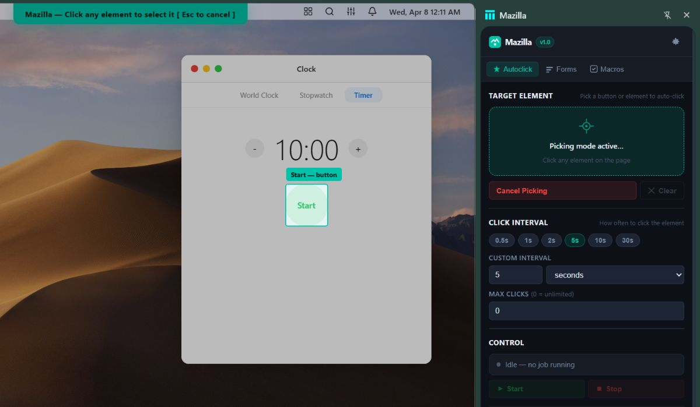
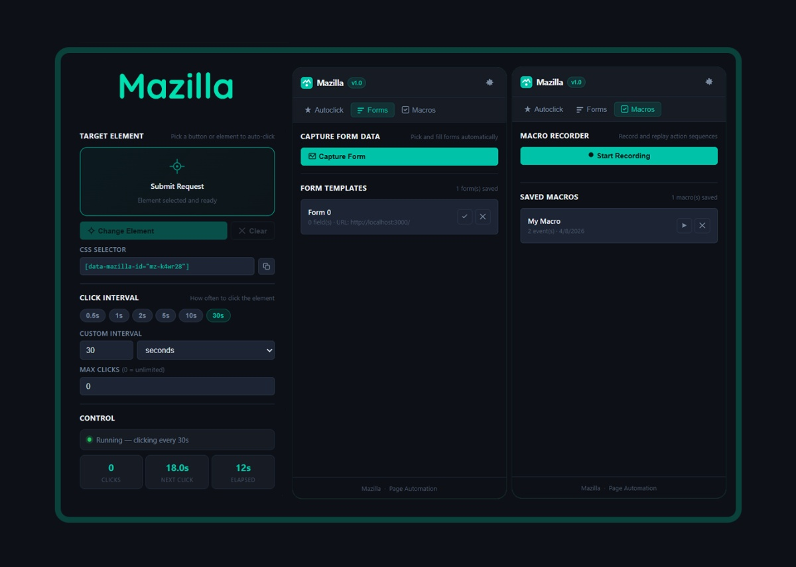

# Mazilla — Browser Extension for Page & Form Automation

A powerful browser extension that lives in your sidebar and automates repetitive tasks: click buttons at intervals, capture and fill forms, save reusable text snippets, and record & replay action sequences.

**[Install from Chrome Web Store →](https://chromewebstore.google.com/detail/mazilla/paofeihadlbigdaoggimkjfhlfacihbk)** · **[View source on GitHub →](https://github.com/alihd-tech/Mazilla)**

## Screenshot 

## Features

### ⚡ Autoclick
Pick any button or element on a webpage and click it automatically at customizable intervals (milliseconds to minutes).

- **Visual element picker** with crosshair, hover overlay, and on-page element labels
- **Flexible intervals**: Presets from 0.5s to 30s, or set custom values
- **Optional max clicks**: Stop after a certain number of clicks
- **Live stats**: Real-time click counter, elapsed time, and countdown to next click
- **Save as jobs**: Persist your autoclick configurations for instant replay later, even after browser restart
- **Labels**: Tag saved jobs and filter by label

### 📋 Form Filler
Capture form fields and their values, then instantly fill them on any matching page with a single click.

- **Auto-detection**: Automatically finds all input, textarea, and select fields
- **Save templates**: Store form data as reusable templates
- **One-click filling**: Fill all matching fields on other pages instantly
- **Perfect for repetitive forms**: Registration, surveys, feedback forms, etc.
- **Labels**: Organize form templates with custom labels and quick filtering

### 📎 Clipboard
Store labeled text snippets and insert them into any focused input or textarea on the page.

- **Labeled values**: Give each snippet a name (e.g. Email, Username) for quick recognition
- **Insert into focused field**: Focus a field on the page, then insert the saved value in one click
- **Copy to system clipboard**: Copy any saved value without leaving the sidebar
- **Rename & delete**: Manage your snippet library over time
- **Persistent storage**: Saved values survive browser restarts

### 🎬 Macro Recorder
Record sequences of clicks and actions, then replay them instantly across pages for complex workflows.

- **Record clicks**: Capture all your clicks on a page with visual event timeline
- **Flexible playback**: 300ms delays between events for reliable automation
- **Save macros**: Store your recorded sequences for instant replay
- **Multi-step automation**: Perfect for workflows involving multiple pages or complex interactions
- **Labels**: Tag macros and filter your library by label

### 🏷️ Labels & organization
Keep large libraries manageable across Autoclick jobs, form templates, and macros.

- **Comma-separated labels** on any saved item (edit via the tag button on each row)
- **Label chips** on saved items for at-a-glance categorization
- **Filter bar**: Click a label to show only matching items, or **All** to reset

### 🎨 UI polish
- **Section titles & hints**: Each area in the sidebar has a clear title and short description
- **Light / dark theme**: Toggle in the header; your preference is remembered

## Installation

### From Chrome Web Store (recommended)

1. Open the [Mazilla listing on the Chrome Web Store](https://chromewebstore.google.com/detail/mazilla/paofeihadlbigdaoggimkjfhlfacihbk)
2. Click **Add to Chrome**
3. Click the Mazilla icon in your toolbar to open the sidebar

### From Source (Developer Mode)

1. **Clone or download the extension**
   - Repository: [github.com/alihd-tech/Mazilla](https://github.com/alihd-tech/Mazilla)
   - Navigate to the project directory

2. **Load as unpacked extension**
   - Open `chrome://extensions/` (or `edge://extensions/` for Edge)
   - Enable **Developer mode** (toggle in top-right)
   - Click **Load unpacked**
   - Select the project folder
   - The Mazilla icon will appear in your toolbar

3. **Open the sidebar**
   - Click the Mazilla icon in your browser toolbar
   - The sidebar panel will open on the right side of your screen

## How to Use

### Autoclick Workflow

1. Open Mazilla sidebar (click the extension icon)
2. Go to the **Autoclick** tab
3. Click **Pick Element** and then click the button you want to autoclick (hover shows a labeled overlay)
4. Set your interval (choose a preset or enter a custom value)
5. Optionally set a max click limit
6. Click **Start** and watch the stats
7. Click **Stop** anytime to stop
8. Click **+ Save current** to save this job for later use
9. Use the tag button on a saved job to add labels; filter with the label bar above the list

### Form Filler Workflow

1. Open Mazilla sidebar
2. Go to the **Forms** tab
3. Navigate to a page with a form you want to capture
4. Click **Capture Form** — Mazilla will automatically detect all fields
5. The form template is saved with all field values
6. On another page with a similar form, click the play button next to your saved template to fill all matching fields instantly
7. Add labels to templates and filter when you have many saved forms

### Clipboard Workflow

1. Open Mazilla sidebar
2. Go to the **Clipboard** tab
3. Enter a **Label** (e.g. Email) and the **Value** text you want to reuse
4. Click **Add to Clipboard**
5. On any page, click into an input or textarea to focus it
6. Click the insert button next to a saved value to paste it into the focused field
7. Use copy, rename, or delete as needed

### Macro Recorder Workflow

1. Open Mazilla sidebar
2. Go to the **Macros** tab
3. Click **Start Recording**
4. Perform your clicks and actions on the page (each click is logged)
5. Click **Stop Recording** when done
6. Enter a name for your macro
7. Your macro is saved and ready to replay
8. Click the play button next to any saved macro to execute the entire sequence
9. Tag macros with labels and use the filter bar to find them quickly

## Technical Details

### Manifest V3
- Uses Chrome's latest Manifest V3 API
- Side panel for UI
- Content scripts for page interaction
- Service worker for background tasks
- Local storage for data persistence

### Key Components

**manifest.json** — Extension configuration with permissions
- `sidePanel`: Opens the sidebar UI
- `scripting`: Injects content scripts
- `storage`: Saves jobs, forms, macros, and clipboard locally
- `tabs`: Routes messages between sidebar and page

**sidebar.html / sidebar.css / sidebar.js** — Main UI and logic
- Tab navigation (Autoclick, Forms, Macros, Clipboard)
- Section headers with titles and hints
- Light/dark theme
- Label chips and filter bars for saved items
- Job, form, macro, and clipboard persistence
- Message routing to content script

**content.js** — Page injection script
- Element picking with visual overlay and hover labels
- Building CSS selectors
- Executing clicks
- Capturing form data
- Inserting clipboard text into focused fields
- Recording and replaying macros
- Banner notifications

**background.js** — Service worker
- Opens sidebar on icon click

## Storage

All data is stored locally in your browser using `chrome.storage.local`:

- **Jobs** (`mazilla_jobs`): Autoclick configurations (including optional labels)
- **Forms** (`mazilla_forms`): Captured form templates (including optional labels)
- **Macros** (`mazilla_macros`): Recorded action sequences (including optional labels)
- **Clipboard** (`mazilla_clipboard`): Labeled text snippets
- **Theme** (`mazilla_theme`): Light or dark UI preference

Data persists across browser restarts and is never sent to external servers.

## Troubleshooting

### Extension doesn't appear in toolbar
- Install from the [Chrome Web Store](https://chromewebstore.google.com/detail/mazilla/paofeihadlbigdaoggimkjfhlfacihbk), or ensure Developer mode is enabled if loading unpacked from `chrome://extensions/`
- Reload the page or restart the browser

### Can't pick elements
- Make sure the content script is running on the page
- Try refreshing the page and opening the sidebar again
- Check that `scripting` permission is granted

### Clipboard insert does nothing
- Click inside an editable `input` or `textarea` on the page first so it has focus
- The field must not be disabled or read-only

### Forms not filling correctly
- Not all field selectors may match between pages (different forms, different IDs)
- Manually adjust selectors if needed or re-capture the form on the target page

### Macros not replaying correctly
- Element selectors may have changed since recording
- Try re-recording the macro on the target page
- Increase delays if elements take time to load

## Browser Support

- **Chrome** 114+ ([Chrome Web Store](https://chromewebstore.google.com/detail/mazilla/paofeihadlbigdaoggimkjfhlfacihbk))
- **Edge** 114+ (Chromium; install from Chrome Web Store or load unpacked)
- **Other Chromium-based browsers** (Opera, Brave, Vivaldi, etc.)

Firefox support coming in a future release.

## Permissions Explained

| Permission | Why It's Needed |
|-----------|-----------------|
| `sidePanel` | Shows the Mazilla sidebar in the browser |
| `activeTab` | Identifies the current tab |
| `scripting` | Injects content script for element picking, form capture, clipboard insert, and macro recording |
| `storage` | Saves jobs, forms, macros, and clipboard locally |
| `tabs` | Routes messages between sidebar and page content |

## Privacy & Security

- **100% local**: All data is stored locally in your browser
- **No tracking**: Mazilla never collects, sends, or processes your data
- **No external calls**: The extension runs entirely offline
- **Open source**: Code is transparent and auditable

## License

MIT License — Feel free to modify and distribute

## Support

For issues, feature requests, or contributions, open an issue or pull request on the [GitHub repository](https://github.com/alihd-tech/Mazilla).

---

**Mazilla v1.3** — Automate your browser, one click at a time.
